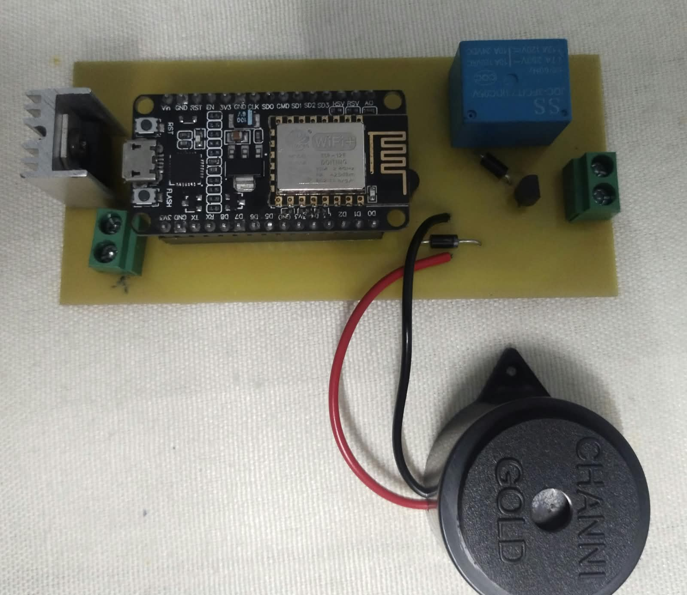
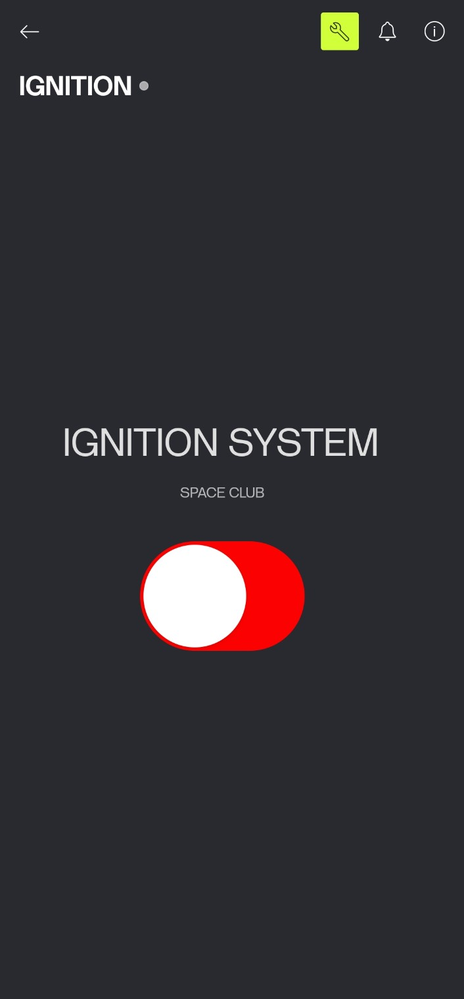

🚀 IoT-Based Rocket Ignition System
Smart Remote Ignition Control & Monitoring System

An IoT-based embedded system developed for rocket ignition control and monitoring. The project integrates custom hardware with a software control interface to provide a controlled and monitored ignition system.

🔧 Hardware & PCB

  

Custom-designed PCB for the rocket ignition control system.

🖥️ Software Control Interface

  

Software interface for system control and status monitoring.

✨ Features
IoT-based remote control
Custom PCB-based hardware
Rocket ignition control
Real-time system status monitoring
Wireless communication
Safety-focused control architecture
Modular system design
🛠️ Technologies Used
Category	Technology
Controller	Microcontroller
Programming	Embedded C
Communication	IoT / Wireless Communication
Hardware	Custom PCB
Monitoring	Software Control Interface
Application	Rocket Ignition System
🔄 System Architecture
        Software Control Interface
                    │
                    │ Wireless / IoT
                    ▼
              Control Unit
                    │
                    │ Control Signal
                    ▼
             Ignition Circuit
                    │
                    ▼
             Rocket Ignition

📁 Project Structure
IoT-Based-Ignition/
│
├── Project Code
│   ├── pcb.jpg
│   └── software.png
├── README.md

🚀 Getting Started
1. Clone the Repository
git clone https://github.com/YashTatode/IoT-Based-Ignition.git

2. Open the Project

Open the firmware and software components using their respective development environments.

3. Configure the Hardware

Connect the controller, communication interface, and ignition control hardware according to the project design.

4. Upload the Firmware

Build and upload the firmware to the microcontroller.

5. Run the Control Software

Launch the software interface and establish communication with the control unit.

🔮 Future Improvements
Advanced telemetry
Long-range communication
Dedicated ground-station software
Data logging
Additional safety interlocks
Real-time diagnostics
👨‍💻 Author

Yash Tatode

B.Tech – Mechatronics Engineering

Interests:

Embedded Systems
Rocketry
IoT & Automation
Robotics
Aerospace Electronics
📄 License

This project is shared for educational and portfolio purposes.
